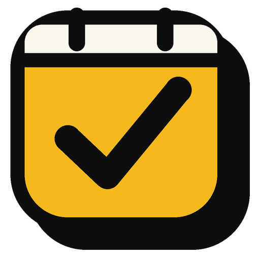

<p align="center"></p>

# PC Schedule

A personal planner for Windows that keeps your whole day in one place: today's goals, habits, obligations, big goals, rules, a shopping list, and a separate page for loose thoughts.

## Download

**[Download PC Schedule for Windows](https://github.com/parastathis/PC-Schedule-stathis/releases/latest)**. Unzip it and run `PC Schedule.exe`. You don't need to install anything.

## What it does

- **Today's goals** ranked by importance. Goals carried over from earlier days show how long they've been waiting.
- **Habits** in tabs (Morning, Body, Mind, Work, Social), each with a 7-day strip and a streak count.
- **Obligations** and **Big goals**, each with a date range you set.
- **Projects**: create them, name them and colour them, then filter every list by one project.
- **Rules**: the principles you want in front of you every day.
- **To buy**: a shopping list that adds up the prices.
- **Thoughts**: a canvas of floating notes you can drag anywhere.
- **Review**: week, month and year summaries of what got done, what slipped and how your habits held.
- **Light and dark** themes.

## Your data

Everything stays on your computer. The app saves on every change to one JSON file and keeps backups:

- one copy per day (the last 30);
- one copy per month and one per year (kept forever).

Nothing is ever deleted automatically: goals stay until you remove them.

## Run from source

```bash
npm install
npm start          # run it
npm run build      # package it into dist/
```

Built with plain HTML/CSS/JS inside [Electron](https://www.electronjs.org/).
